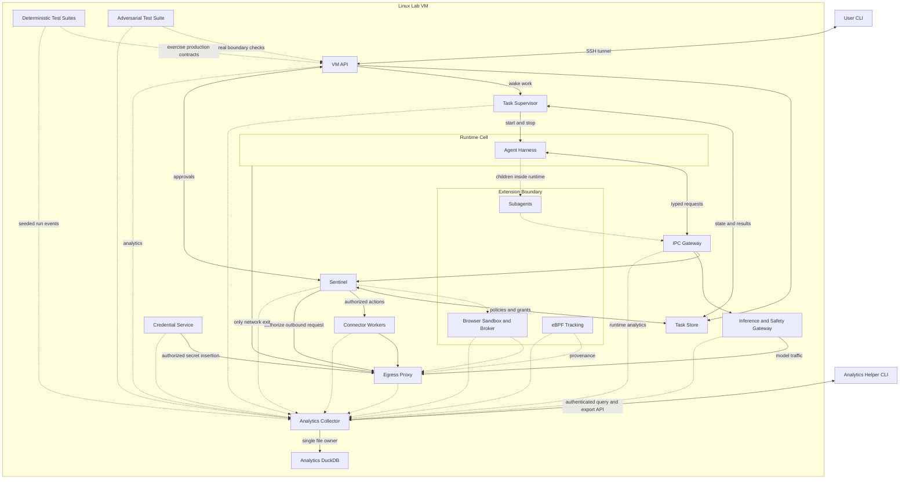

# VM Agent Platform Roadmap



**Goal:** Learn to direct AI to build a platform where a CLI message reaches your Linux VM, starts agent work, and returns results you can inspect and reproduce in tests.

**Reference:** [Meta's Muse architecture](https://research.meta.ai/blog/security-and-safety-for-ai-agents-our-approach-with-muse); preserve the separation of agent execution and trusted services.

**Testing north star:** [Dropbox's Testing sync at Dropbox](https://dropbox.tech/infrastructure/-testing-our-new-sync-engine): design testable protocols and control flow first, then combine focused randomized suites, broader deterministic simulation, and separate native/protocol checks.

**Scope:** One user and one KVM-capable Linux VM; keep hosting and operations affordable while giving modules the complexity their contracts require.

**Implementation:** Use systemd, OpenSSH, nspawn, namespaces, cgroups, seccomp, nftables, and QEMU/KVM; use Go for custom platform code and existing runtimes for reused software.

**Ownership:** AI implements; you specify architecture, review evidence, inspect analytics, and approve completed slices.

**Working method:** Plan each slice as a folder under [docs/plans](plans/AGENTS.md) using [the slice-planning brief](slice-planning.md); agree the architecture first, then the plan files, then what prototype the work needs, if any, before building the robust version. The roadmap orders work, while the plan settles its contracts, tests, analytics, and acceptance evidence.

**Where to run the coding agent:** Start on your Mac for analytics, CLI/API logic, persistence, policies, harness adapters, and deterministic test scaffolding. Use the Linux VM agent for Linux-specific adapters, service setup, kernel boundaries, and real-system checks. You can author any source on either machine; these callouts identify where the implementation can be exercised and accepted.

| Callout | Working environment |
| --- | --- |
| Mac first | Implement and run focused tests locally; use Linux for deployment and target-platform verification. |
| Split | Build portable logic and simulations on Mac; use the VM agent while implementing and testing Linux integration. |
| Linux first | Develop the kernel-facing portion in the KVM-capable VM; portable logic and scenario preparation can stay on Mac. |

**Handoff:** Each slice plan names Mac checks and Linux checks separately. Keep portable code separate from OS adapters and use build constraints where needed; commit and sync source between machines, build native dependencies for the target OS/architecture, and keep databases and credentials local to their environment. Passing Mac tests does not complete required Linux acceptance checks.

**Harness:** Default to [Pi over JSONL RPC](https://pi.dev/docs/latest/cli-integration), controlled by Go inside the runtime boundary; use its existing loop, sessions, compaction, and tools.

**Providers:** Route [Pi's configurable model endpoint](https://pi.dev/docs/latest/models) through trusted inference services to OpenRouter; [fx over ACP](https://github.com/vercel-labs/fx) is an alternative subject to the same adapter tests.

**Diagram:** Dashed analytics paths activate with `--analytics` or `--debug`; every concern emits through the collector, including concerns whose arrows are omitted for readability; the extension box groups optional work, with subagents inside the runtime.

**Design contract for every roadmap item:**

- Define invariants, observable events, an independent expected result, and the appropriate test boundary before implementation.
- Design protocols and persisted models to reject invalid states, including grants without tasks and execution without authorization.
- Give each Go control state machine one owner; express asynchronous I/O as requests and completion events that production adapters execute and test schedulers control.
- Inject clocks, randomness, IDs, scheduling, and external I/O where the chosen suite needs control; keep stateless functions free of unnecessary simulation machinery.
- Exercise production decision and state-transition code in simulations; compare against a separately specified oracle rather than a copy of the implementation.
- Expand an existing simulation when a module enlarges its boundary; create a separate suite only for distinct invariants, protocols, or real-system prerequisites.
- Use MC/DC tables for compound decisions, naming conditions and witness pairs that independently change outcomes; document infeasible pairs.
- Keep fixed seeded regressions and minimized failures in version control; bounded exploratory fuzzing discovers new cases and contributes permanent regressions.
- Let native fuzz corpus bytes drive scenario generation: deterministically decode initial data, action sequences, faults, and a root scheduling seed; save the full input rather than just the seed.
- Record scenario inputs, seed, generator version, code revision, fault schedule, and fixtures; seeds alone cannot reproduce uncontrolled concurrency or remote systems.
- Replay deterministic scenarios twice and compare final state and normalized business-event traces; extra diagnostic logging must not consume random draws or change control decisions.
- Derive named random streams for inputs, faults, and scheduling, and sort Go map-derived choices; keep the original bundle if reduction loses the failure.
- Keep operational state and security audit in SQLite with critical errors in journald; optional analytics must never authorize actions or alter their outcome.

**Suite boundaries and tools:** Proposed platform suites share replay/event helpers; a module extends existing coverage or gets a focused suite when it introduces a distinct invariant or boundary.

| Suite | Boundary and assertions | Tools and replay limits |
| --- | --- | --- |
| Decision and transition | Production policy, budgets, lifecycle, provenance, and preservation/progress invariants. | Go MC/DC tables and native fuzzing over states/actions; [statement coverage](https://pkg.go.dev/cmd/cover) supplements decision evidence. |
| Platform simulation | Connected production state machines with controlled storage, processes, DNS, network, model, and time. | [Go native fuzzing](https://go.dev/doc/security/fuzz/) over bounded scenarios plus a seeded scheduler; [synctest](https://go.dev/blog/testing-time) where suitable; assert progress after faults stop under explicit fairness assumptions. |
| Codec and parser | IPC/JSONL framing, URLs, headers, event validation, and serialization. | Native fuzzing with saved/minimized inputs; full simulation adds little value for these stateless contracts. |
| Native adapter | Actual databases, filesystems, sockets, and process adapters against the simulated contract. | Go `testing`, temporary databases, and subprocesses; controlled operations replay closely, while real concurrency gets separate checks. |
| Protocol contract | Actual CLI, Pi, HTTP/TLS, and connector behavior, detecting drift in fakes/fixtures. | [testscript](https://github.com/rogpeppe/go-internal/tree/master/testscript), `httptest`, actual Pi, and service test accounts; record external responses where replay cannot be guaranteed. |
| System E2E | SSH, systemd, nspawn, nftables, QEMU, browser, and complete workflows. | Go `testing`/`os/exec`, [race checks](https://go.dev/doc/articles/race_detector), and [Playwright](https://playwright.dev/docs/intro) fixtures; a scenario seed does not control OS scheduling. |
| Live model evaluation | Task quality, tool behavior, and resistance to hostile content using the chosen model/harness. | Versioned scenarios, spend caps, trajectories, and repeated trials; live inference remains outside deterministic guarantees. |

**Fuzzing policy:** Native Go fuzzing is the default; replay committed `f.Add`/corpus cases in ordinary tests, and run budgeted discovery jobs separately. Each target is deterministic per input, even though the fuzz engine's exploration order is not. Use [Rapid](https://pkg.go.dev/pgregory.net/rapid) only when structured generation/shrinking materially improves a suite.

**Simulation data generation:** Each `FuzzPlatform` input constructs a fresh bounded scenario through a versioned deterministic decoder: related task/grant/workspace data, synthetic service/model responses, operations, failures, and scheduling choices. Use explicit commands where shrinking helps, and derived named PRNG streams for larger generated data; all randomness comes from the input. Enforce size/step/logical-time limits, use stable ordering, and avoid wall-clock-dependent scenario behavior.

**Replay contract:** Identical corpus bytes, decoder version, code revision, and fixtures reproduce the initial state, controlled schedule, final state, and normalized trace within the suite boundary. Keep each case isolated; generate valid domain state by construction, deliberate hostile actions explicitly, and malformed wire data in focused parser suites. Native minimization shrinks the input while the invariant checker confirms the same failure; retain the original bundle too.

**Mental model for each suite:** Choose the boundary → generate related starting states and actions → control external effects and scheduling → check independent safety/preservation/progress invariants → replay and reduce the failure.

**Simulation threshold:** Use focused native fuzz targets for codecs, stateless policies, redaction, and query construction; use stateful simulation when correctness depends on sequences, interleavings, failures, or recovery. Add scheduling complexity only when a named invariant requires it.

**Determinism boundary:** A controlled suite can be deterministic even when production is concurrent; reproducing a simulated failure does not establish that real filesystem, kernel, harness, or provider behavior matches the simulated contract.

**Comments as learning material:** Require generous explanatory comments in AI-generated testing and analytics code, with ASCII state machines, timelines, decision tables, and event flows; explain the suite boundary, generators, independent oracle, replay command, and what remains untested.

```text
// native fuzz input -> deterministic scenario decoder
//                           |
//              initial data + actions + faults + scheduling seed
//                           |
// virtual time -> production transitions -> independent oracle
//                  |
//                  v
// redacted events -> bounded queue -> collector -> analytics.duckdb
//
// Explain why this fault exposes the invariant and how to replay it.
// Label simulated boundaries and the real-system checks still required.
```

## Analytics Collector, Analytics DuckDB, and Analytics Helper CLI — inspect the first event

1. Build and run a Go collector locally as the sole owner of `analytics.duckdb`, using the [DuckDB Go driver](https://github.com/duckdb/duckdb-go); deploy it under systemd when the Linux VM is ready.
2. Define versioned events with module, source trust, task/action/trace IDs, parent event, source sequence, logical time, duration, outcome, and test seed.
3. Gate every module's redacted event emission on debug/analytics flags; authenticate producers, bound buffers, count drops, and support flush barriers.
4. Add query, task timeline, module summary, seed lookup, and snapshot/export commands through the collector, respecting [DuckDB's concurrency model](https://duckdb.org/docs/current/connect/concurrency).
5. Add retention and query limits, and preserve platform operation during collector failure, disk exhaustion, or analytics disablement.

**Tests:** Native fuzzing plus MC/DC tables only, with no deterministic simulation: fuzz event validation/redaction, framing, and queries; fuzz buffering and flush barriers as operation sequences against a model; run store and query targets on temporary DuckDB files.

**Work environment — Mac first:** Implement collector, helper CLI, temporary DuckDB fuzz targets, redaction fuzzing, and MC/DC tables locally; use Linux for its native build, systemd deployment, and service-failure checks.

**Observe:** Ingestion lag, dropped events, producer identity, schema version, and collector health; exclude secrets and raw private content.

**CLI gains:** `vm-agent-analytics events`, `task <id>`, and `query` explain the first recorded event before agent features exist.

## Deterministic Test Suites — replay the first failure

6. Establish small shared seed, virtual-time, replay, and event helpers, then grow distinct suites at the boundaries listed below.
7. Use native `FuzzXxx` inputs to generate bounded initial data, actions, faults, and scheduling seeds; seed `f.Add` with meaningful baseline scenarios.
8. Execute decoded scenarios through production transitions and independent invariants; replay twice and minimize failures while preserving original corpus bytes and traces.
9. Export decision witnesses and annotated ASCII traces, including a worked approve → expire → dispatch example whose oracle rejects stale authority.

**Tests:** Framework self-tests cover replay equality, oracle sensitivity, decoder bounds, fault delivery, and reducer validity; later slices extend relevant suites instead of one mandatory universal simulator.

**Work environment — Mac first:** Build generators, virtual time, controlled adapters, oracles, fuzz targets, and replay tooling locally; replay on Linux too, while real kernel adapters remain separate checks.

**Observe:** Seed, scenario/version, steps, faults, failing invariant, decision witnesses, and normalized trace hashes.

**CLI gains:** `vm-agent test replay <bundle>` reproduces a failure; `test describe <suite>` and analytics show its boundary, oracle, and timeline.

## User CLI, VM API, and Linux Lab VM — deliver a message

10. Configure systemd identities and a Go VM API behind an authenticated OpenSSH tunnel.
11. Define bounded message envelopes, correlation IDs, deadlines, and retry-safe submission contracts with simulation adapters.
12. Send a CLI message to the VM and return a correlated receipt plus transport analytics.

**Tests:** Native codec fuzzing and MC/DC admission tables first; grow delivery simulation for duplicates/disconnects; testscript/httptest plus real SSH E2E verifies transport.

**Work environment — Split:** Implement CLI, HTTP API, codecs, admission, and delivery simulation on Mac; use the VM agent for systemd identities, API deployment, and SSH E2E from Mac to VM.

**Observe:** Request acceptance/rejection, retries, tunnel errors, and transport latency.

**CLI gains:** `vm-agent send "hello"` reaches the VM; analytics correlates the client attempt and server receipt.

## Task Store — queue and inspect durable work

13. Persist tasks, budgets, authoritative events, and state transitions in SQLite separately from analytics and credentials.
14. Inject persistence boundaries and enumerate legal transitions, transaction failures, duplicate submissions, and restart points.
15. Preserve queued tasks across restarts and emit transition analytics only with accurate commit/rollback outcomes.

**Tests:** Focused transition fuzzing plus MC/DC deduplication tables; expand platform simulation through persistence/restart boundaries; native SQLite tests verify transactions, migrations, and crash recovery.

**Work environment — Mac first:** Implement the store, migrations, transactions, and fault simulations with local temporary databases; verify native builds and crash/restart behavior on the Linux target filesystem too.

**Observe:** Queue depth, commit failures, transition history, duplicate suppression, and wait duration.

**CLI gains:** `status`, `events`, and `result` inspect durable task state after reconnecting.

## Runtime Cell — execute workspace tasks

16. Configure user-mapped nspawn workspaces with mount, namespace, seccomp, cgroup, and nftables restrictions.
17. Give the Go supervisor injectable process/filesystem adapters with bounded outputs, deadlines, cancellation, and artifact collection.
18. Execute a workspace command with host-secret access and outbound networking blocked.

**Tests:** Extend simulation with process exits, output floods, and timeout races; MC/DC execution guards; real nspawn/systemd isolation and resource-limit tests are required.

**Work environment — Split:** Build supervisor contracts, output limits, and process simulations on Mac; use the VM agent for nspawn, namespaces, seccomp, cgroups, nftables, and actual isolation tests.

**Observe:** Process lifecycle, exit reason, resource consumption, tool duration, and artifact metadata.

**CLI gains:** `run "pwd"` executes inside the VM's runtime cell and exposes its output and process timeline.

## IPC Gateway and Sentinel — approve a proposed action

19. Authenticate Unix-socket peers and resolve task identity and user intent from trusted state.
20. Specify pure allow/deny/ask decisions with explicit condition IDs and MC/DC witness tables.
21. Suspend protected actions and bind approval to exact parameters, task, destination, expiry, and use count.
22. Reject spoofed identities, altered actions, expired grants, and replay while recording authoritative decisions.

**Tests:** Expand the simulator with approval/cancellation/expiry interleavings; fuzz codecs in a focused protocol suite; real socket tests verify peer credentials and ACLs.

**Work environment — Split:** Implement Sentinel decisions, grants, codecs, and interleaving simulations on Mac; implement and verify Linux peer-credential authentication and runtime socket access in the VM.

**Observe:** Condition outcomes, decision reasons, pending duration, grant consumption, and rejection causes.

**CLI gains:** `approvals`, `approve`, and `deny` control waiting actions, with an analytics explanation for every decision.

## Credential Service and Egress Proxy — make an authenticated request

23. Implement enrollment, rotation, revocation, and scoped surrogate handles behind injectable credential and resolver interfaces.
24. Authorize concrete destinations, addresses, redirects, methods, paths, and bodies before inserting secrets.
25. Enforce proxy-only Linux routing, block direct IPv4/IPv6/UDP/DNS escape, and reject unsupported HTTPS tunnels.
26. Complete a configured service request with secrets absent from runtime output and analytics.

**Tests:** Extend simulation with DNS rebinding, redirects, credential rotation, and revocation; MC/DC authorization tables; focused URL/header fuzzing and real TLS/network-boundary tests.

**Work environment — Split:** Build credential logic, authorization, proxy/TLS fixtures, and DNS simulations on Mac; use the VM agent for proxy-only routing and IPv4/IPv6/UDP/DNS escape checks.

**Observe:** Redacted destination metadata, authorization latency, credential-handle lifecycle, denied routes, and retry causes.

**CLI gains:** Tasks can call authenticated APIs; analytics explains the request path without exposing credentials.

## Agent Harness + Inference and Safety Gateway — turn a message into agent work

27. Pin Pi and adapt JSONL prompts, events, sessions, tools, and cancellation to Go contracts with a replaceable harness transport.
28. Route Pi through a streaming-compatible inference endpoint backed by OpenRouter and host-side credentials.
29. Connect privileged tools through IPC while preserving instruction/untrusted-content separation and runtime isolation.
30. Enforce model allowlists, reserved tokens, spending limits, retries, and concurrency caps before sending requests.
31. Persist answers, tool events, session references, and reconciled usage with bounded analytics payloads.

**Tests:** Native JSONL/stream and budget fuzzing plus MC/DC safety tables; expand simulation with scripted model/RPC responses; actual Pi protocol tests and separately budgeted live-model evaluations verify external behavior.

**Work environment — Split:** Build Go adapters, scripted Pi/model fixtures, streaming, and budget tests on Mac; verify actual Pi integration, privileged-tool routing, and inference inside the Linux runtime boundary in the VM.

**Observe:** Model selection, token/cost estimates versus actual usage, streamed-event sequence, tool activity, refusals, and stop reasons.

**CLI gains:** `send "summarize these workspace files"` starts Pi work and returns an answer with usage and a complete task trace.

## Connector Workers — complete a useful external task

32. Integrate a calendar API using a dedicated test account, typed connector contracts, and sanitized recorded fixtures.
33. Expose Pi tools while running connector logic in isolated workers with per-worker credential access.
34. Authorize an exact proposed update and execute it through the proxy with idempotency where supported.

**Tests:** Expand simulation through connector execution and uncertain writes; MC/DC worker/action permissions; httptest contract checks and a controlled live-account E2E test.

**Work environment — Split:** Implement connector logic, sanitized API fixtures, idempotency, and simulations on Mac; use Linux for isolated workers, scoped credentials, proxy integration, and assembled E2E.

**Observe:** Connector latency, proposed versus executed parameters, external request IDs, retries, and ambiguous outcomes.

**CLI gains:** `send "move my meeting to 3pm"` completes an approved calendar update with a traceable external outcome.

## Task Supervisor — recover and cancel work

35. Decouple Pi execution from the client connection and reconcile task checkpoints, harness sessions, and authoritative events.
36. Propagate cancellation to processes, pending approvals, and queued actions through an explicit lifecycle state machine.
37. Recover supported writes idempotently and surface uncertain outcomes instead of repeating side effects blindly.

**Tests:** Expand the shared simulation across all core modules with disconnect, crash, retry, and cancellation schedules; MC/DC recovery tables; real SIGKILL/restart E2E and race checks.

**Work environment — Split:** Implement lifecycle, checkpoint, recovery, and cancellation scenarios on Mac; use the VM agent for systemd restarts, orphan-process handling, and real runtime recovery checks.

**Observe:** Checkpoint age, recovery steps, cancellation latency, orphan processes, and uncertain side effects.

**CLI gains:** Reconnect to ongoing work, `cancel` it, and inspect why recovery resumed or stopped.

## Adversarial Test Suite — verify the assembled platform

38. Assemble real Linux/protocol checks around existing scenarios and expand the suite whose boundary owns each new invariant.
39. Combine hostile content, network escape, credential theft, approval replay, outages, and budget exhaustion in regression scenarios.
40. Gate changes on MC/DC witnesses, fixed scenarios/seeds, native fuzz corpora, bounded discovery runs, applicable real-system checks, and analytics on/off equivalence.
41. Demonstrate CLI delivery, Pi work, approval, external execution, reconnection, and analytics-assisted replay of a blocked attack.

**Tests:** Real-kernel E2E cannot be proven by simulation; live-model behavior is evaluated with recorded outcomes and budgeted repeated trials, without claiming deterministic inference.

**Work environment — Linux first:** Prepare hostile inputs, policies, and deterministic regressions on Mac; run assembled security E2E and isolation/network attacks against disposable Linux environments, with the CLI on Mac.

**Observe:** Suite boundary/version, seed/corpus IDs, MC/DC witness gaps, statement coverage, failure artifacts, and E2E results.

**CLI gains:** `vm-agent test core` produces an inspectable verification report; analytics ties a failure to its replay bundle.

---

## Extension Boundary

The core above includes testing and analytics throughout; these optional slices expand those same contracts and simulation boundaries.

### Browser Sandbox and Broker — work with websites

42. Run Chromium in a QEMU/KVM guest and expose constrained broker tools with injectable navigation/action interfaces.
43. Protect credentials, constrain CDP access, enforce egress/form policy, and pause the agent during user takeover.
44. Add malicious website fixtures and browser lifecycle events to the existing simulation and analytics contracts.

**Tests:** Extend broker-state simulations and MC/DC form/takeover decisions; Playwright supplies controlled sites, while real broker/Chromium/KVM E2E proves browser boundaries.

**Work environment — Split:** Build broker policy, website fixtures, and simulated navigation on Mac; use the KVM-capable Linux VM for QEMU guest setup, actual broker/Chromium integration, and isolation E2E.

**Observe:** Navigation, broker actions, form approvals, credential-fill pauses, takeover, and blocked transfers.

**CLI gains:** Submit website tasks and inspect or approve browser actions with a correlated browser timeline.

### Subagents — delegate bounded work

45. Launch child Pi sessions through the existing adapter with inherited permissions and shared cost/concurrency budgets.
46. Model parent/child completion and cancellation explicitly, recording causal links and aggregate usage.
47. Expand platform scenarios to cover fan-out, partial failure, permission narrowing, and whole-tree cancellation.

**Tests:** Extend the existing lifecycle simulator; MC/DC delegation/budget tables; real multi-session Pi E2E and race checks cover actual concurrency.

**Work environment — Split:** Implement task-tree transitions, permission inheritance, budgets, and fan-out simulations on Mac; verify child Pi sessions, whole-tree cancellation, and runtime containment in Linux.

**Observe:** Parent/child task tree, fan-out, inherited grants, cancellation propagation, and accumulated cost.

**CLI gains:** One message launches parallel subtasks whose results and spending remain visible under the parent.

### eBPF Tracking — refine network approvals

48. Add cgroup attribution and required kernel hooks, using [cilium/ebpf](https://github.com/cilium/ebpf) for Go-side loading and observation.
49. Implement provenance transitions and data-read/inheritance tracking with explicit handling of missing or dropped signals.
50. Expand egress simulations and reduce prompts only for narrowly permitted traffic with demonstrated clean provenance.

**Tests:** MC/DC provenance tables and seeded lost/reordered-event simulation; real verifier/hook/propagation checks use kernel [BPF selftests](https://docs.kernel.org/bpf/bpf_devel_QA.html) and disposable Linux VMs.

**Work environment — Linux first:** Implement and test BPF programs, loaders, cgroup hooks, verifier behavior, and kernel attribution in the VM; keep provenance decisions and lost-event simulation portable for Mac tests.

**Observe:** Hook availability, process attribution, provenance transitions, dropped signals, and approval reasons.

**CLI gains:** Eligible traffic needs fewer prompts, and analytics shows the provenance evidence behind each decision.
